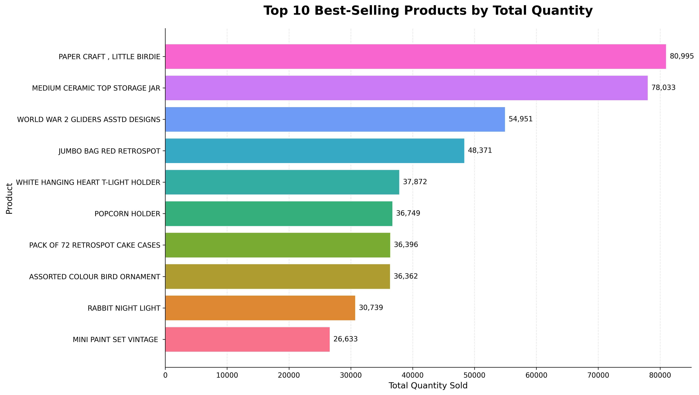
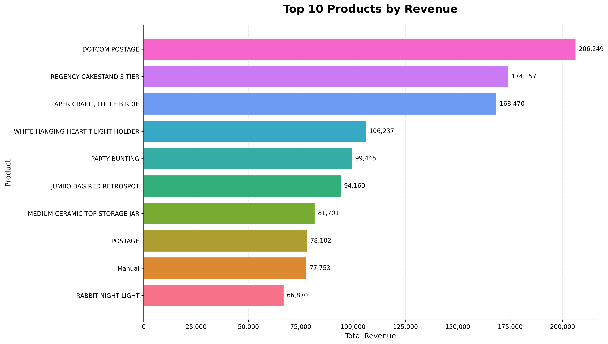
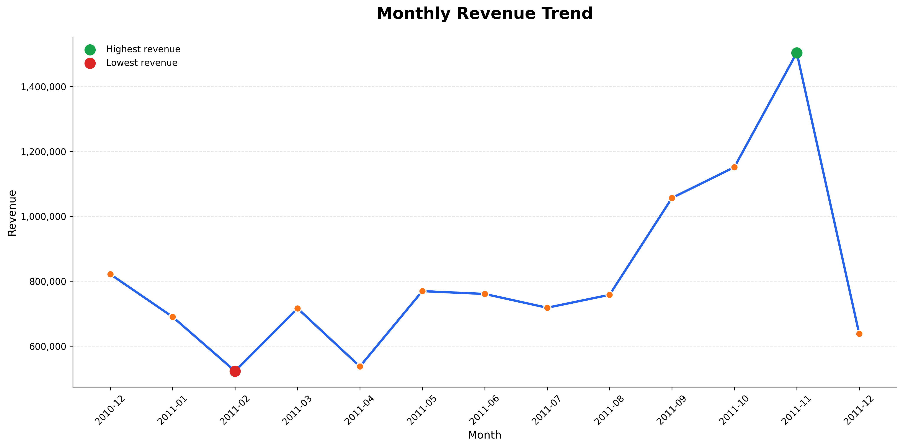
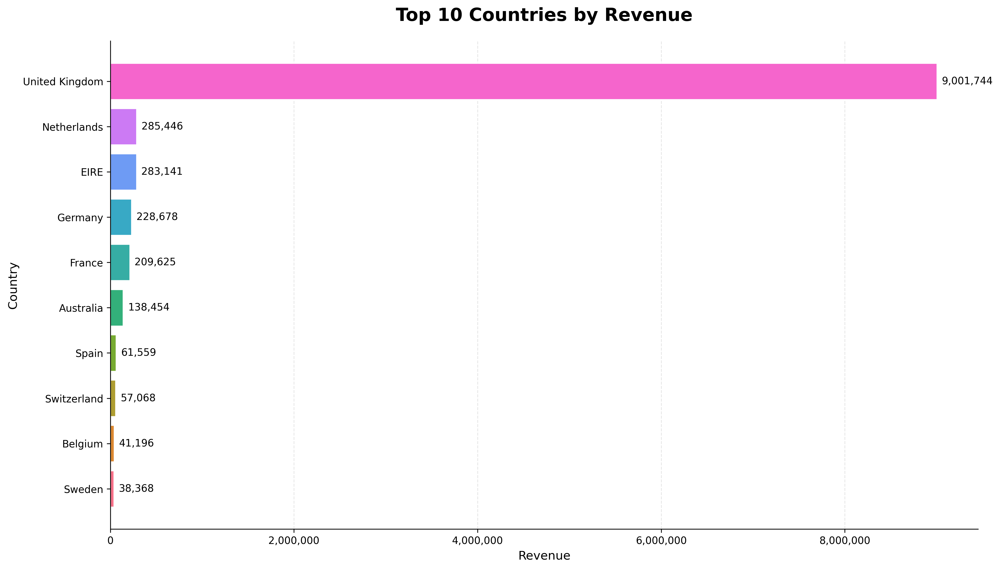
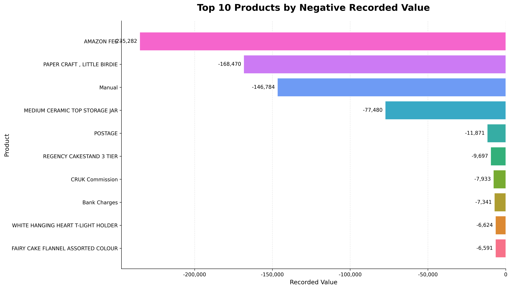

# Python Data Explorer: Online Retail Sales Analysis

A Python-based data analysis project exploring retail transactions using Pandas, NumPy, Matplotlib, and Seaborn. This project covers the complete data analysis workflow, from data inspection and cleaning to exploratory analysis, visualization, and business reporting.

**Project status:** Completed
**Project type:** Exploratory Data Analysis (EDA)
**Focus:** Data cleaning, feature engineering, sales analysis, data visualization, and business reporting.

---

## 1. Project Overview

The goal of this project is to analyze historical retail sales transactions and identify patterns in product performance, revenue, monthly sales, geographic distribution, and negative-quantity transactions.

The project follows a practical data analyst workflow:

1. Obtain and inspect the dataset.
2. Investigate data quality.
3. Clean and validate transaction records.
4. Engineer useful analytical features.
5. Calculate business metrics.
6. Perform exploratory data analysis.
7. Create visualizations to communicate findings.
8. Document insights and limitations in a final report.

The analysis was performed using the UCI Online Retail dataset, which contains transaction records from December 2010 to December 2011.

## 2. Business Questions

This project addresses the following business questions:

- What is the total positive sales revenue?
- What is the average order value?
- Which products have the highest sales volume?
- Which products generate the most revenue?
- How does revenue change over time?
- Which countries contribute the most sales?
- How many negative-quantity transactions are recorded?
- How do negative-quantity transactions affect recorded revenue?

## 3. Dataset

The dataset used in this project is **Online Retail**, obtained from the UCI Machine Learning Repository.

- **Source:** [UCI Online Retail Dataset](https://archive.ics.uci.edu/dataset/352/online+retail)
- **Format:** Excel (`.xlsx`)
- **Original records:** 541,909
- **Period:** December 2010 – December 2011
- **License:** CC BY 4.0

The dataset contains transaction-level information from a UK-based online retailer.

### Data Dictionary

| Column        | Description                        |
| ------------- | ---------------------------------- |
| `InvoiceNo`   | Invoice or transaction identifier  |
| `StockCode`   | Product identifier                 |
| `Description` | Product description                |
| `Quantity`    | Number of units in the transaction |
| `InvoiceDate` | Date and time of the transaction   |
| `UnitPrice`   | Price per unit                     |
| `CustomerID`  | Customer identifier                |
| `Country`     | Customer's country                 |

The original dataset does not contain predefined product categories or sales regions. Therefore, the analysis focuses on products and countries using the fields provided.

## 4. Tools and Technologies

| Technology       | Purpose                                         |
| ---------------- | ----------------------------------------------- |
| Python           | Data analysis and programming                   |
| Pandas           | Data cleaning, transformation, and aggregation  |
| NumPy            | Numerical operations and validation             |
| Matplotlib       | Data visualization                              |
| Seaborn          | Statistical and categorical visualization       |
| Jupyter Notebook | Interactive analysis and documentation          |
| Git              | Version control                                 |
| GitHub           | Source code management and portfolio publishing |

## 5. Repository Structure

```text
python-data-explorer/
├── data/
│   ├── Online Retail.xlsx
│   ├── cleaned_transactions.csv
│   ├── cleaned_sales.csv
│   └── engineered_sales.csv
├── notebooks/
│   └── sales_analysis.ipynb
├── charts/
│   ├── top_products_quantity.png
│   ├── top_products_revenue.png
│   ├── monthly_revenue.png
│   ├── top_countries_revenue.png
│   └── negative_value_products.png
├── reports/
│   └── analysis_report.md
├── .gitignore
├── requirements.txt
└── README.md
```

The structure separates datasets, analysis notebooks, generated visualizations, and the final report.

## 6. Project Workflow

### Step 1: Data Acquisition

Obtained the UCI Online Retail dataset and loaded the Excel file into a Pandas DataFrame.

### Step 2: Initial Data Inspection

Examined the dataset using Pandas to understand its structure, including:

- Number of rows and columns
- Column names and data types
- Summary statistics
- Missing values
- Duplicate records
- Transaction dates and numerical values

### Step 3: Data Quality Investigation

Investigated the following data-quality issues:

- Missing customer identifiers
- Missing product descriptions
- Exact duplicate records
- Negative and zero quantities
- Zero and negative unit prices
- Cancellation indicators
- Missing transaction dates

### Step 4: Data Cleaning

Created a cleaned transaction dataset and removed exact duplicate records.

| Metric                               |   Count |
| ------------------------------------ | ------: |
| Original records                     | 541,909 |
| Exact duplicates removed             |     528 |
| Cleaned transaction records          | 541,381 |
| Records excluded from positive sales |   1,763 |

The cleaning process retained negative-quantity transactions for separate analysis and created a positive sales dataset using the defined filtering criteria.

Missing customer identifiers were retained in the transaction data rather than automatically discarded.

### Step 5: Feature Engineering

Created additional analytical features to support sales analysis.

- **Revenue:** Calculated as `Quantity × UnitPrice`.
- **Year:** Extracted from the transaction date.
- **Month:** Extracted as a numerical month.
- **MonthName:** Extracted as the month name.
- **Day:** Extracted from the transaction date.
- **DayOfWeek:** Extracted as the weekday.
- **YearMonth:** Created for monthly sales aggregation.

These features enabled the analysis of revenue, product performance, and monthly sales trends.

### Step 6: Exploratory Data Analysis

Performed exploratory analysis to investigate:

- Overall sales performance
- Product quantity and revenue
- Monthly revenue trends
- Country-level sales performance
- Negative-quantity transactions

The analysis used grouped aggregations and descriptive statistics to identify patterns in the transaction data.

### Step 7: Data Visualization

Created five charts to communicate the findings:

1. Top 10 products by quantity sold
2. Top 10 products by revenue
3. Monthly revenue trend
4. Top 10 countries by revenue
5. Products with the largest negative recorded values

The visualizations use horizontal bar charts and a monthly line chart, with value labels and formatted axes where appropriate.

### Step 8: Reporting

Documented the methodology, key findings, visualizations, business insights, and limitations in `reports/analysis_report.md`.

## 7. Key Findings

### Overall Sales Performance

| Metric                                           |        Result |
| ------------------------------------------------ | ------------: |
| Positive sales revenue                           | 10,642,110.80 |
| Total orders                                     |        19,960 |
| Total units sold                                 |     5,572,420 |
| Average order value                              |        533.17 |
| Negative-quantity records                        |        10,587 |
| Recorded value of negative-quantity transactions |   -893,979.73 |

### Product Performance

- **Highest-selling product by quantity:** PAPER CRAFT, LITTLE BIRDIE, with 80,995 units.
- **Second-highest by quantity:** MEDIUM CERAMIC TOP STORAGE JAR, with 78,033 units.
- **Third-highest by quantity:** WORLD WAR 2 GLIDERS ASSTD DESIGNS, with 54,951 units.
- **Highest-revenue product:** DOTCOM POSTAGE.

The product with the highest sales volume is different from the product generating the highest revenue. This demonstrates why both metrics are useful when evaluating product performance.

### Monthly Revenue

- **Highest-revenue month:** November 2011.
- **Lowest-revenue month:** February 2011.

Monthly revenue varied throughout the observed period. The results describe the historical pattern but do not establish the reasons behind the changes.

### Country Performance

- **Highest-revenue country:** United Kingdom.
- **Country with the most orders:** United Kingdom.

The United Kingdom was the leading market in the analyzed dataset in both revenue and order count.

### Negative-Quantity Transactions

The analysis identified 10,587 negative-quantity records with a combined recorded value of -893,979.73.

These transactions reduce net recorded revenue when their signed values are included. Negative quantities may represent returns or other transaction adjustments, so they should not automatically be treated as confirmed customer returns.

## 8. Visualizations

The project includes the following charts:

### 1. Top 10 Products by Quantity



Compares the ten products with the highest total quantities sold.

### 2. Top 10 Products by Revenue



Shows the ten products generating the highest positive sales revenue.

### 3. Monthly Revenue Trend



Displays changes in positive sales revenue over the observed months.

### 4. Top 10 Countries by Revenue



Compares the countries with the highest positive sales revenue.

### 5. Products by Negative Recorded Value



Shows products with the largest negative recorded transaction values.

## 9. Business Insights

The analysis provides several areas for further business investigation.

- **Product performance:** Compare high-volume products with high-revenue products to understand differences in their contribution to sales.
- **Monthly sales:** Investigate the factors associated with high- and low-revenue months.
- **Geographic distribution:** Examine the concentration of sales in the United Kingdom and compare other countries.
- **Negative transactions:** Investigate negative-quantity records to understand their causes and their impact on revenue reporting.
- **Sales monitoring:** Track both revenue and order volume to obtain a more complete picture of sales performance.

These are potential areas for investigation based on the observed results, not proven explanations of customer behavior or business performance.

## 10. Limitations

- The dataset covers December 2010 to December 2011 and may not represent current retail behavior.
- The dataset does not include product costs, so revenue cannot be interpreted as profit.
- Some transactions have missing customer identifiers, limiting customer-level analysis.
- Negative quantities may represent returns or other transaction adjustments.
- The dataset does not contain predefined product categories or sales regions.
- The analysis is descriptive and does not establish the causes of observed sales patterns.
- The results depend on the data-cleaning rules and positive sales filtering criteria used in this project.

## 11. Installation and Usage

### Prerequisites

- Python 3.10 or later
- Git
- Jupyter Notebook or Visual Studio Code with Jupyter support

### Clone the Repository

```bash
git clone https://github.com/EndriasEshetu/python-data-explorer.git
cd python-data-explorer
```

### Install Dependencies

```bash
python -m pip install -r requirements.txt
```

Make sure `requirements.txt` includes the packages used in the notebook, including `pandas`, `numpy`, `matplotlib`, `seaborn`, `jupyter`, and `openpyxl` if loading the original Excel file.

### Launch the Notebook

```bash
jupyter notebook
```

Open `notebooks/sales_analysis.ipynb` and run the cells in order.

The notebook uses relative paths to access the dataset and save the generated files. Run it from the notebook's expected directory structure.

## 12. Future Improvements

Possible extensions to this project include:

- Add SQL analysis using a relational database.
- Build an interactive dashboard with Power BI or Streamlit.
- Automate data-quality validation.
- Perform customer segmentation using available customer identifiers.
- Analyze repeat purchasing behavior.
- Investigate sales forecasting with additional data.
- Explore product profitability if cost data becomes available.

## 13. Author

**Endrias Eshetu**

GitHub: [EndriasEshetu](https://github.com/EndriasEshetu)

---

This project was developed for learning and portfolio purposes. The findings are based on the available historical dataset and the documented analysis methodology.
